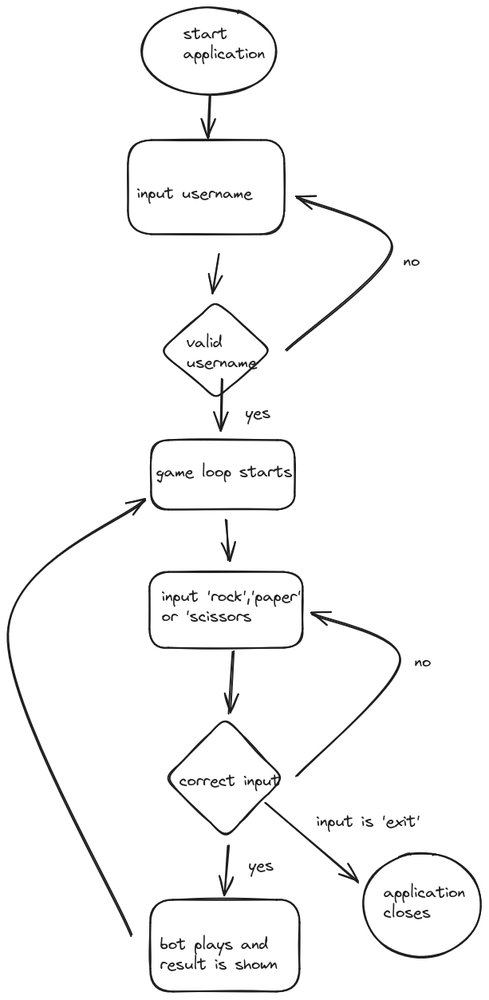

# Paper Rock Scissors Exercise

This project is a Paper Rock Scissors cli game built in golang.

## Running the project

Included are binaries for linux, macos and windows.
To run the game open a terminal/console in the binaries folder with the binary of your os and just type out the executable name e.g. ` ./rockpaperscissors.exe` for windows

**disclaimer** these binaries target amd64 architecture. If you can't run the binary you can follow the steps below to generate your own.

### Running it yourself
If you wish to run  or test this project make sure to have the latest version of Go installed.
https://go.dev/doc/install for more information.

Once you have Go installed and correctly configured, open a terminal/console in the root of the project and type `go run .` this will fire up the project.

To run the tests make sure in your terminal/console you are in the tests folder and type `go test . -v`


### Gameflow
a flow chart showing the flow of the game:



### Playing the game
First input your username
After this the gameloop starts in which you will have a choice of `rock`, `paper` or `scissors`.
This will go on untill you either close the cli or you can type `exit` and it will exit the game

## The algorithm for calculating the winner
To calculate the winner which seems to follow a pattern this algorithm is used 
`winner := (3 + answer1 - answer2) % 3`
the logic is as follows: <br>
    Rock=1, Paper=2, Scissors=3 <br>
	  if 1 answer1 wins <br>
	  if 2 answer2 wins <br>
	  if 0 tie <br>
	  The +3 in the beginning is to prevent a negative value <br>
The algorithm is also heavily tested to make sure that it is valid.<br>

_You can skip this next part if you already know Go._

## Comparison of Go and Kotlin for clarity

### Classes
Go does not have a direct concept of classes instead it uses composition pattern to create lightweight pseudo classes. <br>
These two examples are technically the same.

**Go**
```
type baseUserModel struct {
  username string
	score    int
}

func (base *baseUserModel) IncrementScore() {
	base.score++
}
```

**Kotlin**
```
Class Person {
  var username: string
  var score: int
  
  fun IncrmentScore(){
    score++
  }
}
```

### Interfaces in Go
  In Kotlin you would implement an interface as
  ```
  Class Child : MyInterface {
    override fun bar() {
        // body
    }
  }
```

In Go you do not implement an interface instead it checks if our struct/class object implements the same functions as the interface and therefore is usuable for things like Dependency Injection. Example

```
func DoSomething(val MyInterface) {
  ...
}

DoSomething(structWithSimilarFunctions)
```
In the last part if the struct has the same functions as implied by the interface it implements the interface. If not you get an error

As they describe it in the Go community: 'if it quacks like a duck and acts like a duck its a duck'


